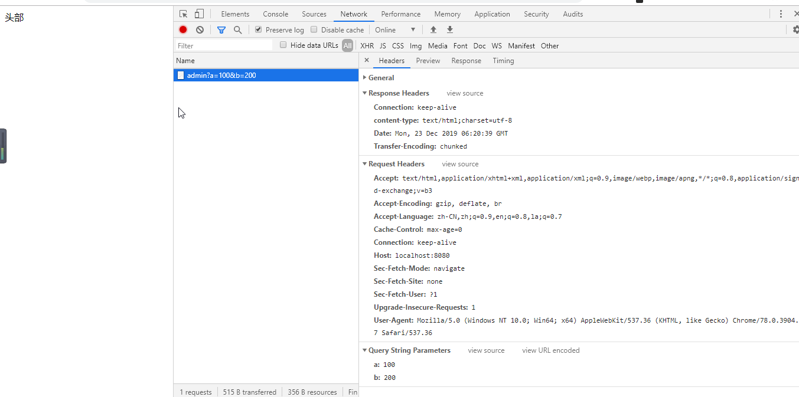

### WEB 服务

使用 nodejs 创建 HTTP 服务器

```js
//1. 引入 http 内置模块
var http = require('http');

//2. 创建服务
var server = http.createServer(function(request, response){
    response.end('hello world!!');
});

//3. 监听端口
server.listen(8000);
```

* request 是对请求报文的封装对象
* response 是对响应的封装对象

#### 获取请求

```js
//获取请求方法
console.log(request.method);

//获取http版本
console.log(request.httpVersion);

//获取请求路径
console.log(request.url);

//获取请求头
console.log(request.headers);

//获取请求体
request.on('data', function(chunk){})
request.on('end', function(){});
```

#### 设置响应

```js
//设置状态码
response.statusCode = 200;

//设置响应头
response.setHeader('content-type','text/html;charset=utf-8');

//设置响应体
response.write('body');

//结束响应
response.end();

```

注意:

* 响应体不能设置为数字
* end 方法也可以设置响应体

#### 静态资源服务

静态资源是指内容不会改变的资源， HTML 文件，CSS 文件，JS 文件，图片资源都属于静态资源

* GET   /index.html     返回 public 目录下的 index.html 内容
* GET  /css/app.css     返回 public/css  目录下的 app.css 文件内容 
* GET  /js/app.js     返回 public/js目录下的 app.js文件内容
* GET  /img/logo.png     返回 public/img目录下的 logo.png 文件内容 


##  通过chrome 查看网络请求



1. 打开网络控制台
2. 点击要查看的请求
3. 在右侧会出现相信内容


Headers 头信息,  响应头信息, 请求头信息

Preview  预览, 可以查看响应体 HTML 解析后的样子

Response  响应体的内容 