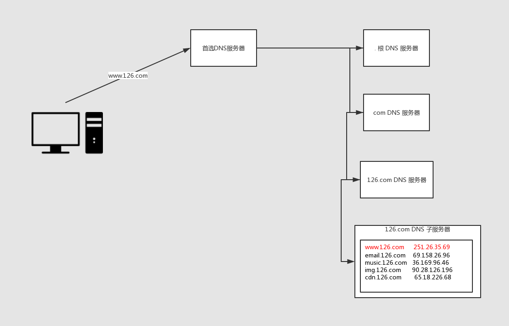
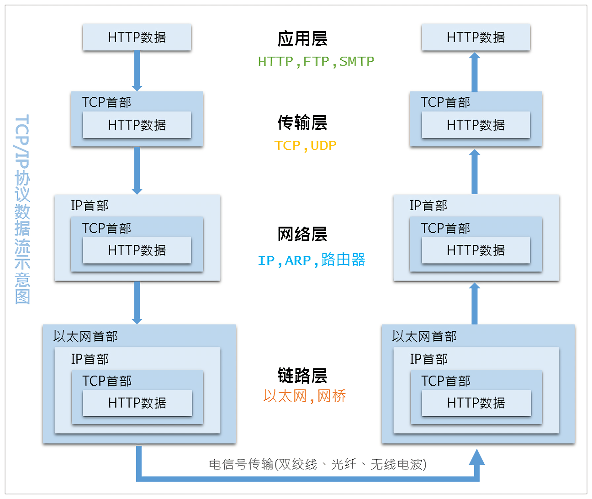
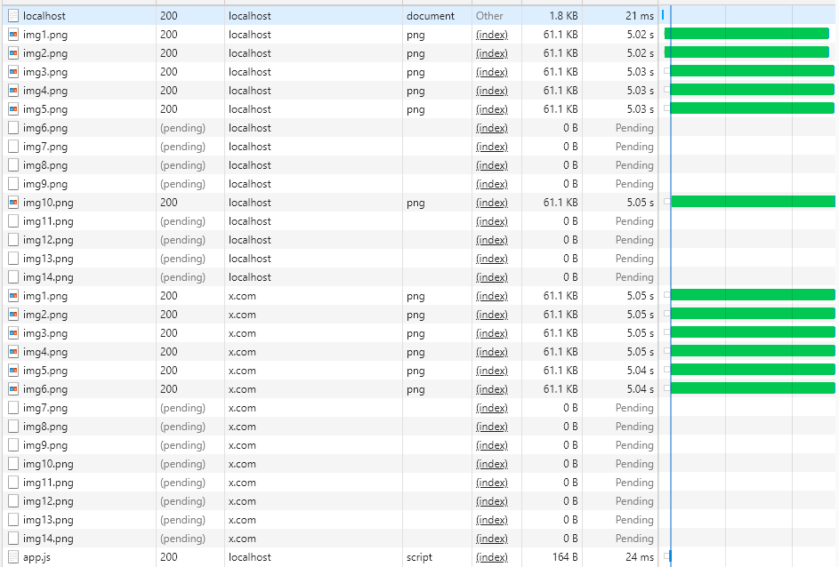
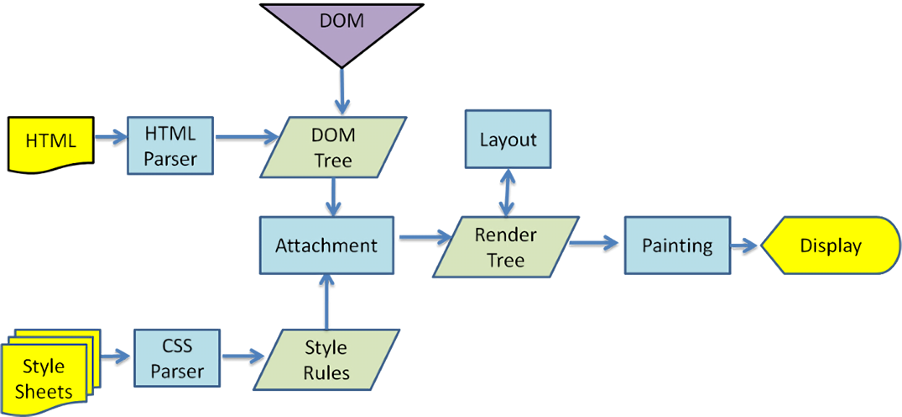

## 用户输入URl，一直到用户能看到界面，期间经历了什么？


### DNS解析

DNS 解析就是通过域名找到服务器 IP 地址

* 找浏览器 DNS 缓存解析域名

* 找本机 DNS 缓存：(备注：查看本机DNS缓存命令：ipconfig/displaydns )

* 找路由器 DNS 缓存

* 找运营商 DNS 缓存（80%的 DNS 查找，到这一步就结束）

如果没有找到揭露，则会迭代查询从全球 13 台根 DNS 服务器开始
```shell script
dig www.126.com +trace
```



进行 TCP / IP（协议）连接，三次握手（根据上一步请求回来的ip地址，去联系服务器）

* 第一次握手：由浏览器发给服务器，「在么？」
* 第二次握手：由服务器发给浏览器，「在呢，有事儿你说」
* 第三次握手：由浏览器发给服务器，「好，我跟你说个事儿」


### 发送请求

浏览器将 HTTP 报文进行封装，而后经过 TCP/IP 协议封装后，通过网络发送给服务器



每层模型的职责：

- **应用层**：定义数据格式，并按照对应的格式解读数据（HTTP）
- **传输层**：定义端口，确认主机上应用程序的身份，并将数据包交给对应的应用程序；（TCP）
- **网络层**：定义IP地址，确认主机所在的网络位置，并通过IP进行MAC寻址，对外网数据包进行路由转发（IP）
- **链路层**：对0和1进行分组，定义数据帧，确认主机的物理地址，传输数据；


### 响应

服务器接到请求后，对请求进行处理，然后将 HTTP 响应返回给客户端

.jpg)

### HTML 解析 

浏览器接收到 HTML 后，对 HTML 进行解析

##### 1.  预解析

浏览器提前请求外部资源，每个域名并行 6 个请求（chrome）



##### 2. 生成 DOM 树

```html
<!DOCTYPE html>
<html>
  <head>
    <meta name="viewport" content="width=device-width,initial-scale=1">
    <link href="style.css" rel="stylesheet">
    <title>Critical Path</title>
  </head>
  <body>
    <p>Hello <span>web performance</span> students!</p>
    <div></div>
  </body>
</html>
```


1. **转换：** 浏览器从磁盘或网络读取 HTML 的原始字节，并根据文件的指定编码（例如 UTF-8）将它们转换成各个字符。
2. **令牌化：** 浏览器将字符串转换成 [W3C HTML5 标准](http://www.w3.org/TR/html5/)规定的各种令牌，例如，“<html>”、“<body>”，以及其他尖括号内的字符串。每个令牌都具有特殊含义和一组规则。
3. **词法分析：** 发出的令牌转换成定义其属性和规则的“对象”。
4. **DOM 构建：** 最后，由于 HTML 标记定义不同标记之间的关系（一些标记包含在其他标记内），创建的对象链接在一个树数据结构内，此结构也会捕获原始标记中定义的父项-子项关系：*HTML* 对象是 *body* 对象的父项，*body* 是 *paragraph* 对象的父项，依此类推。


##### 3.构建 CSSOM 树

```css
body { font-size: 16px }
p { font-weight: bold }
span { color: red }
p span { display: none }
img { float: right }
```


##### 4. 构建 Render 树（渲染树，呈现树）

DOM 树与 CSSOM 树合并后形成渲染树，渲染树只包含渲染网页所需的节点


##### 5.  布局（Layout）

通过 Render 树，可以知道网页中有哪些节点，节点的从属关系，通过这些计算出每个节点在屏幕上的大小和位置


##### 6.  绘制

根据布局计算出的位置以及 render 树的样式，通过显卡，把内容画到屏幕上




##### 6. 最终呈现 


### 断开连接

四次挥手（确保数据的完整性）

* 第一次挥手：由浏览器发给服务器，我的东西接受完了，你断开吧。
* 第二次挥手：由服务器发给浏览器，我还有一些东西没接收完，你等一会，我接收好了且验证好了我告诉你
* 第三次挥手：由服务器发给浏览器，我接收完（验证完）了，你断开吧。
* 第四次挥手：由浏览器发给服务器，好的，那我断开了。

注：为什么握手要三次，挥手要四次？

握手之前，还没有进行数据的传输，确保握手就可以了。
挥手之前，可能正在进行数据的传输，为了确保数据的完整性，必须多经历一次验证（继续接收）

  
