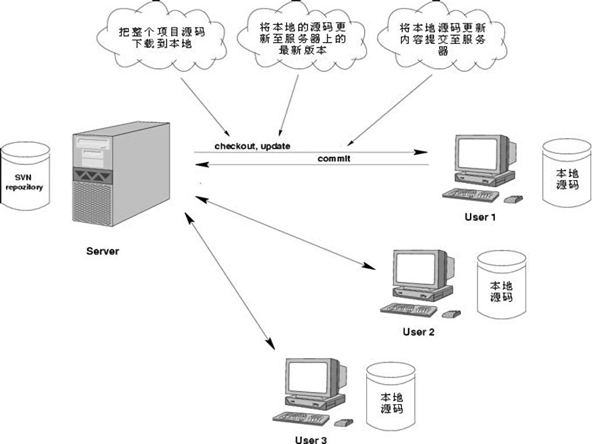
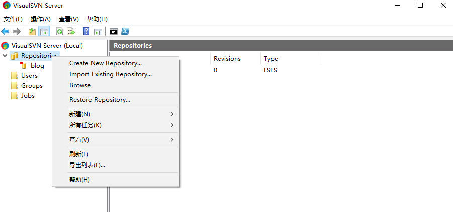
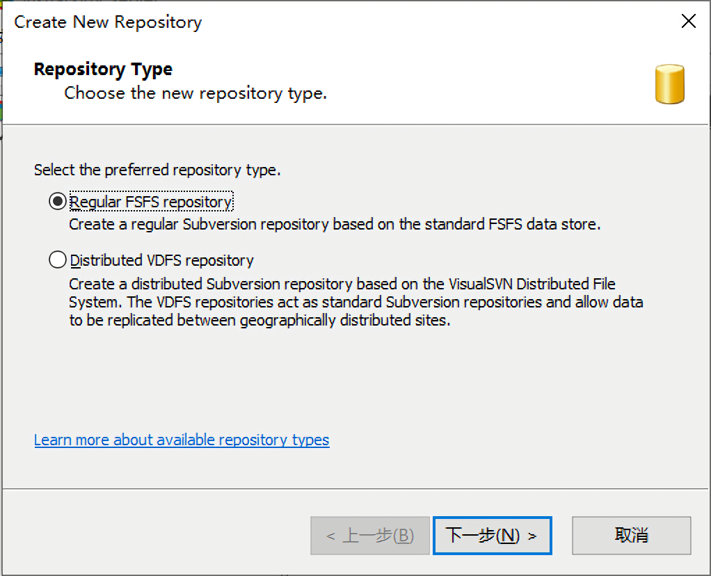
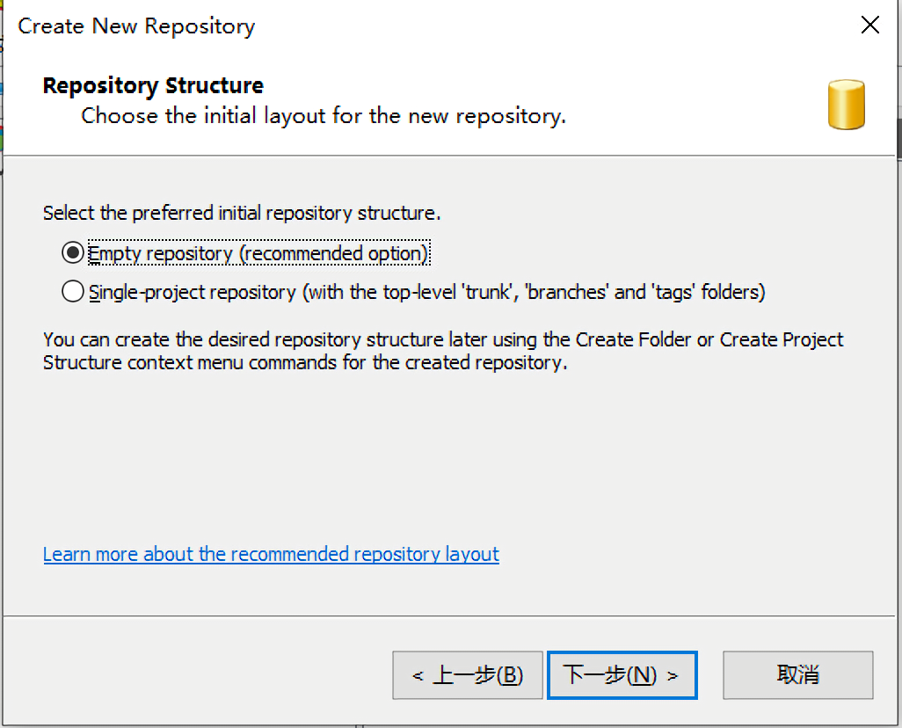
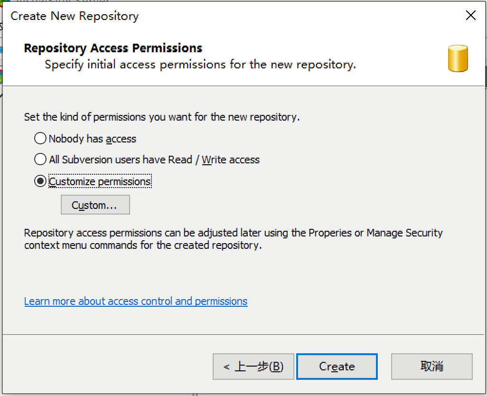
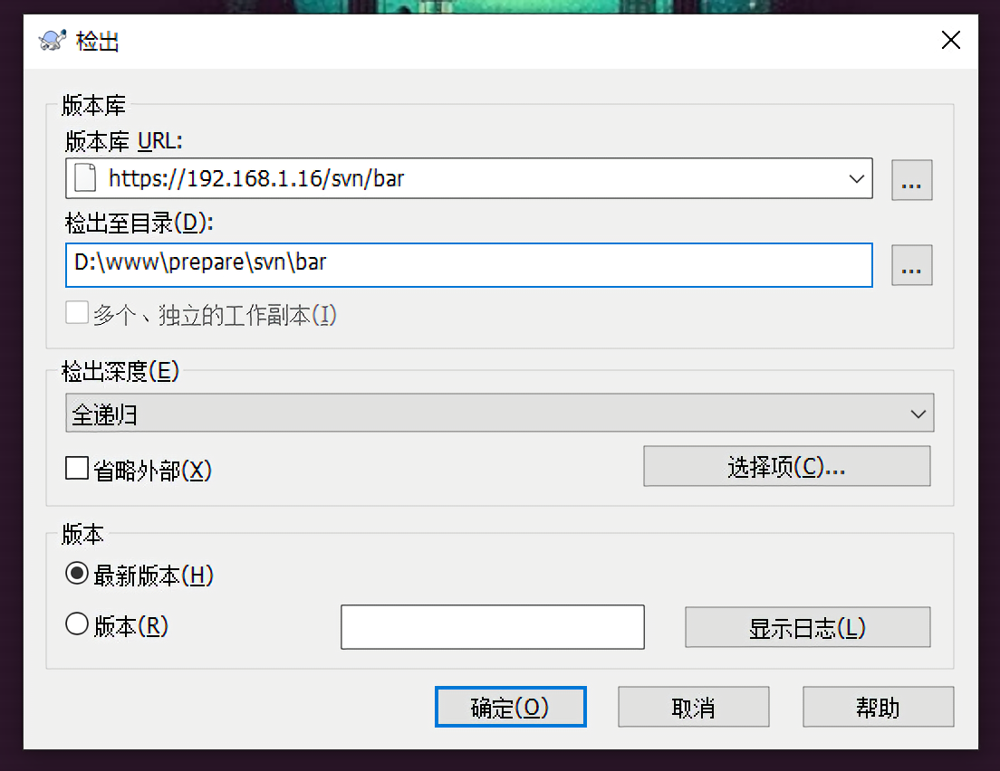
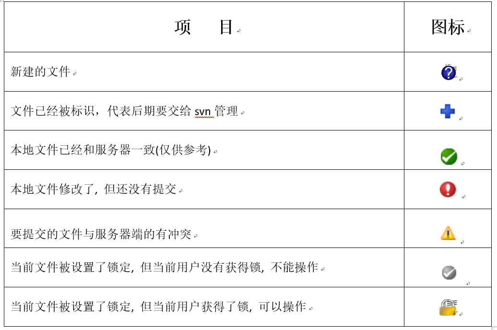

# SVN

## 介绍

SVN 是 subversion 的缩写，是一个开源的版本控制系统。SVN 需要安装两个软件，一个是客户端，安装在开发者的电脑，另一个是服务端，通常安装在另一台独立电脑。

## 作用

版本控制系统在项目开发中作用重大，能记录文件的历史状态，主要的功能有以下几点

* 代码备份
* 版本回退
* 协作开发
* 权限控制

## 使用流程

### 软件安装

一、安装 svn 服务器

<https://www.visualsvn.com/>

二、安装 svn 客户端与语言包

<https://tortoisesvn.net/>

### 仓库创建

#### 1 创建入口

#### 2 仓库类型

* Regular 常规仓库
* distributed 分布式仓库

#### 3 仓库结构

* empty repository 空仓库
* single-project repository 为单项目仓库包含分支、标签文件夹

#### 4 用户权限

* Nobody has access 没有人有权限。 
* All Subversion users have Read / Write access 所有人都有权限
* Customize permissions 自定义权限

### 客户端基本流程

#### 开始没有代码

##### 1 检出代码

在工作文件夹下右键 -> svn 检出 -> 输入仓库地址即可

##### 2 创建文件 / 修改文件

对工作区文件进行修改或者创建，工作区内容发生改变，可以轻松将修改提交到 SVN 服务器中

##### 3 提交代码

工作文件夹中右键 -> svn 提交 -> 填写说明 + 选择提交的文件 -> 确定

#### 开始有一定的代码

1. 创建一个仓库

2. 检出代码的时候==注意文件夹设置==，这里会提示是一个非空文件夹，点击检出即可

检出后使用方式跟上面的流程一致。

### 工作使用流程

第一次使用工作流程：

1. 获得 SVN 服务器的地址以及账号密码
2. 检出代码
3. 开发项目
4. 提交代码

日常的工作流程：

1. 更新代码
2. 开发项目
3. 提交代码

## 其他功能

### 日志查看

可以通过日志来查看文件的历史提交记录。操作方式

工作区右键 ->  tortoiseSVN -> 显示日志

### 版本回退

项目运行过程中，项目会遇到一些意外情况不能正常运行，这个时候需要尽快的恢复服务，最快的解决方法是回滚到上一个版本的状态。 SVN 可以将代码恢复到制定的历史状态

- 工作区右键 -> tortoiseSVN -> 更新至版本
- 在日志窗口 -> 指定版本右键 -> 更新项目至版本 

### 撤销修改

如果对修改的代码不满意，或修改不成功，可以把本次的修改撤销

工作区右键 -> tortoiseSVN -> SVN 还原

### 忽略文件

如果需要忽略文件，则使用菜单  文件 -> 右键 -> TortoiseSVN -> 去除版本控制增加到忽略列表

### 全局忽略文件

很多时候我们项目文件夹中需要一些自己独有的文件，比如编辑器的配置，本地配置文件等，这个时候不需要将这些文件加入到版本库中。工作区右键 -> tortoiseSVN -> 设置 -> 全局忽略样式

## 多人合作

版本控制软件另一个重要作用在于多人合作开发

### 冲突

当多个开发者对同一个文件进行修改的时候，就会产生冲突，解决方法有如下

1. 手动解决
   * 将冲突文件修改为最终正确的样子
   * 删除自动生成的文件
   * 提交
2. svn 工具解决
   * 在冲突文件上右键-> SVN ->编辑冲突
   * 在编辑器上进行文件编辑 -> 将文件改为最终正确的样子
3. webstorm 解决
   * 在左侧冲突文件上 ==右键 -> subversion -> edit conflict==
   * 在弹出的编辑器菜单中编辑文件

>  大原则: 将冲突文件修改为最终正确的样子.

## 附录

### 文件状态图标说明

### 图标不显示解决

1. 重启电脑
2. 重启 windows 资源管理器进程

## 练习

1. 组长创建一个仓库
2. 并且创建一个文件  `名单.md`
3. 将自己的名字写入到该文件中， 并进行提交

