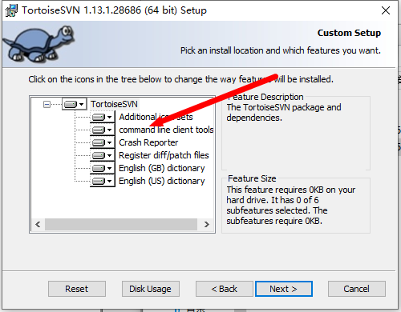
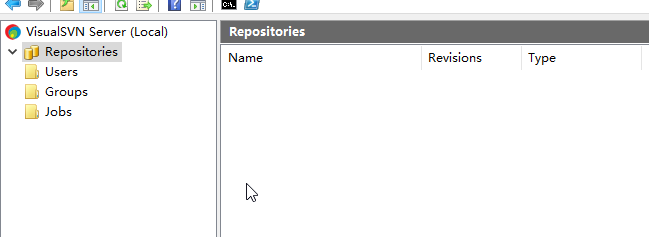
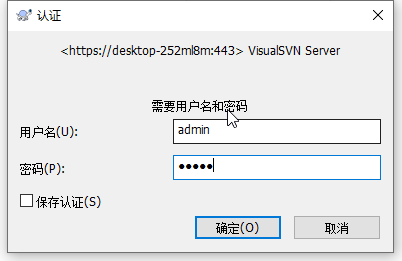
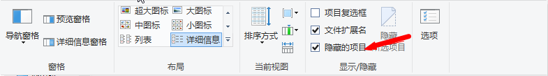
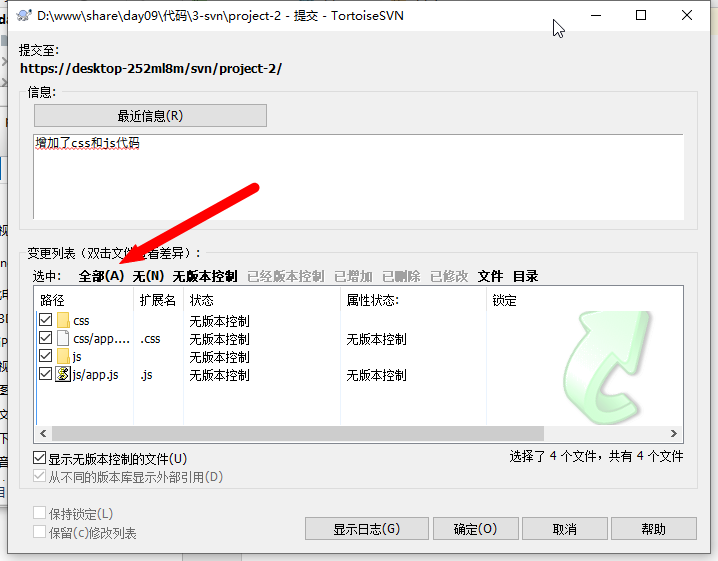
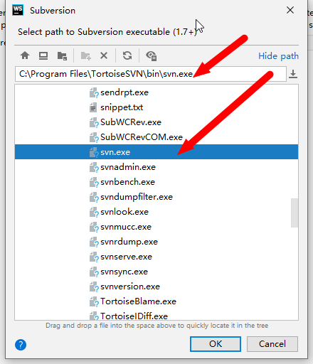
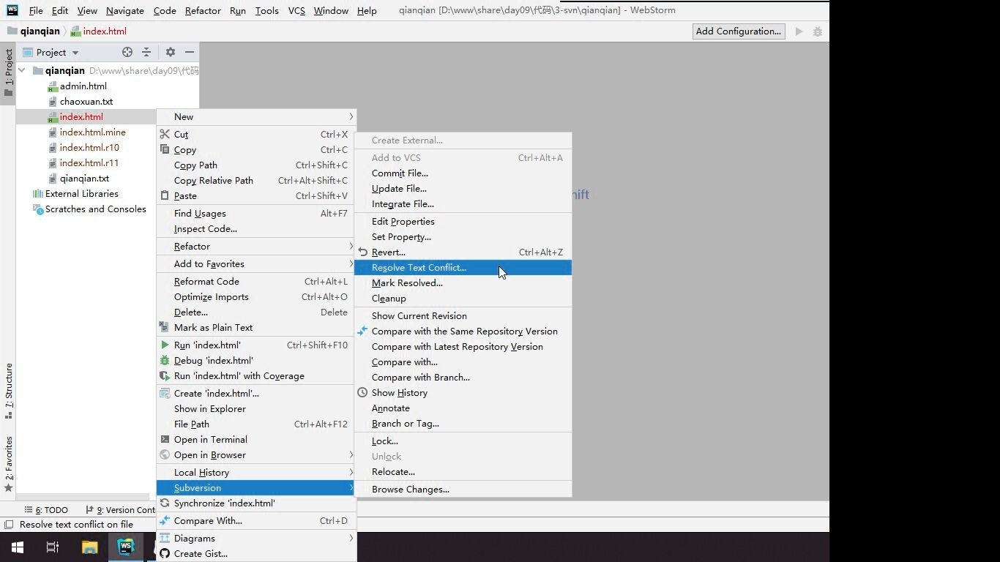
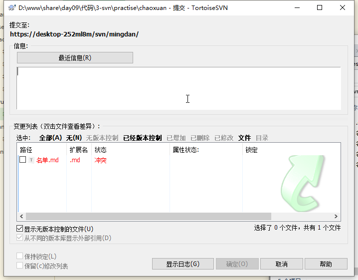

# 第九天

## 弧度转角度
```js
var jiaodu = hudu * 180 / Math.PI;
```

## 根据对边和邻边计算弧度
```js
var hudu = Math.atan2(Y, X);
```

## 1password 密码管理工具
lastpass 免费版本

## 服务端 和 客户端
- 服务端一般是安装在一台单独的电脑      (server)
- 客户端一般安装在用户的电脑或者手机设备上 (client)

## 关于软件下载
尽量到官方网站下载

## SVN 安装
- 主机名称不要使用中文
- 安装路径不要使用中文



> 如果需要结合 IDE 使用的话, 需要点击 command line client tolls 

## svn 服务器




- Repositories  仓库
- Users         用户
- Groups     组
- Jobs         任务(工作)


### 客户端检出

> 检出至目录 如果说是一个起始项目， 建议选择一个空目录
>
> 如果需要管理有一定代码的文件夹， 这个时候可以选择一个非空目录


### 中文的报错信息


建议放置到某个盘符的根目录下，双击安装即可。

### 保存身份验证信息

可以免密码操作



###如果看不到 .svn 文件夹




### clover 

是一个软件， 像浏览器一样管理资源管理器


### 提交文件时全选文件




SVN 地址

```
https://DESKTOP-252ML8M/svn/H50919/
```

* https 协议
* DESKTOP-252ML8M 主机名
* /svn/H50919/   路径

```
https://192.168.25.29/svn/H50919/
账号： h50919
密码： h50919
```

> <span style="color:red">每次提交之前，先做更新</span>


### webstorm 配置 svn




webstorm 解决冲突



### 遇到冲突文件不能直接提交



> 冲突解决的原则： 